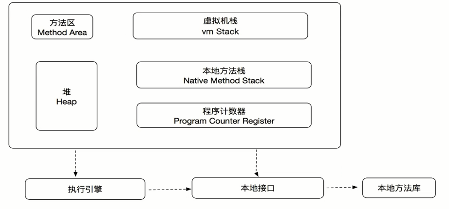
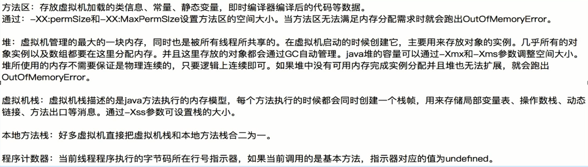
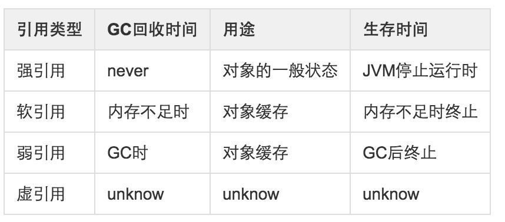

# 认识JVM,Redis进阶操作和Git

## JVM虚拟机结构

## JVM内存机制和参数配置

### 1.加载
1. 通过类的全限定名获取定义此类的二级制字节流
2. 将这个字节流所代表的静态存储结构转化为方法区的运行时数据结构
3. 在内存中生成一个代表这个类的java.lang.Class对象,作为方法区这个类的各种数据的访问入口

### 2.验证
为了确保class文件的字节流中包含的信息符合当前虚拟机的要求

1. 文件格式验证: 验证字节流是否符合class文件格式的规范
2. 元数据验证: 对字节码描述的信息进行语义分析
3. 字节码验证: 通过数据流和控制流分析,确定程序语义是合法的,符合逻辑的
4. 符号引用验证: 发生在虚拟机将符号引用转化为直接引用的时候

### 3.准备
准备阶段是正式为类变量分配内存并设置类变量初始值的阶段,主要针对静态变量

### 4.解析
虚拟机将常量池内的符号引用替换为直接引用的过程

### 5.初始化
类初始化阶段是类加载过程中的最后一步,这个才是开始执行类中定义的Java程序代码,在准备阶段,变量已经赋过一次系统要求的初始值,而在初始化阶段,则根据程序员指定的主观计划去初始化类变量和其它资源.

## GC回收

### 垃圾回收算法
1. 引用计数算法: 给对象添加一个引用计数器,每当有一个地方引用它时,计数器的值就+1,当失效的时候,计数器就-1,计数器为0的对象不可以使用,优先被回收.
2. 可达性分析算法: 通过"GC Roots"对象作为起点的引用链,从上往下搜索,一个对象到"GC Roots"没有引用相连,说明不可用.

### 四种对象引用类型
1. 强引用:是使用最普遍的引用：Object o=new Object();  特点：不会被GC
2. 软引用:用来描述一些还有用但是并非必须的对象，在Java中用java.lang.ref.SoftReference类来表示。对于软引用关联着的对象，只有在内存不足的时候JVM才会回收该对象。因此，这一点可以很好地用来解决OOM的问题，并且这个特性很适合用来实现缓存：比如网页缓存、图片缓存等。
3. 弱引用:只具有弱引用的对象拥有更短暂的生命周期。在垃圾回收器线程扫描它所管辖的内存区域的过程中，一旦发现了只具有弱引用的对象，不管当前内存空间足够与否，都会回收它的内存。不过，由于垃圾回收器是一个优先级很低的线程，因此不一定会很快发现那些只具有弱引用的对象。
4. 虚引用:也称为幻影引用：一个对象是都有虚引用的存在都不会对生存时间都构成影响，也无法通过虚引用来获取对一个对象的真实引用。唯一的用处：能在对象被GC时收到系统通知，JAVA中用PhantomReference来实现虚引用。

对比:

### finalize()方法
对象在被回收之前需要经历两次标记过程,如果发现对象经可达性分析检测,没有引用关联,它将会被标记并且进行筛选,筛选条件是对此对象是否有必要执行finalize方法

### GC收集算法
1. 标记-清除算法: 标记所有需要回收的对象,然后依次全部清除,但是有缺点,一是效率不足,标记和清除两个过程效率不高,二是空间问题会产生很多碎片,对于大对象无法分配内存.
2. 复制算法: 将内存分为大小相等的两块,每次用一块,当一块内存用完,将存活的对象移动到另一块,然后将本块内存全部清除.
3. 标记-整理算法: 让存活的对象向一端移动,然后清理掉边界意外的空间.
4. 分带收集算法: 分为新生代和老年代,新生代对已死对象进行清除,少量存活的对象迁移到老年代,然后老年代才用标记清除算法或者标记整理算法进行清理.

### 垃圾收集器
1. Serial收集器
2. ParNew收集器
3. ParallelScavenge收集器
4. SerialOld收集器
5. ParallelOld收集器
6. CMS收集器
