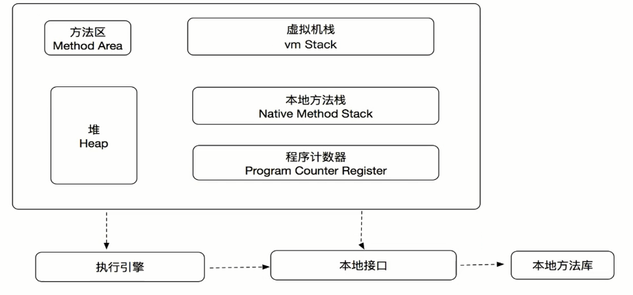
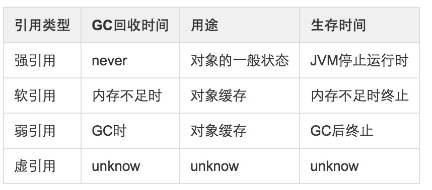

# 认识JVM,Redis进阶操作和Git

## JVM虚拟机结构




## JVM内存机制和参数配置

### 1.加载
1. 通过类的全限定名获取定义此类的二级制字节流
2. 将这个字节流所代表的静态存储结构转化为方法区的运行时数据结构
3. 在内存中生成一个代表这个类的java.lang.Class对象,作为方法区这个类的各种数据的访问入口


### 2.验证
为了确保class文件的字节流中包含的信息符合当前虚拟机的要求

1. 文件格式验证: 验证字节流是否符合class文件格式的规范
2. 元数据验证: 对字节码描述的信息进行语义分析
3. 字节码验证: 通过数据流和控制流分析,确定程序语义是合法的,符合逻辑的
4. 符号引用验证: 发生在虚拟机将符号引用转化为直接引用的时候

### 3.准备
准备阶段是正式为类变量分配内存并设置类变量初始值的阶段,主要针对静态变量

### 4.解析
虚拟机将常量池内的符号引用替换为直接引用的过程

### 5.初始化
类初始化阶段是类加载过程中的最后一步,这个才是开始执行类中定义的Java程序代码,在准备阶段,变量已经赋过一次系统要求的初始值,而在初始化阶段,则根据程序员指定的主观计划去初始化类变量和其它资源.


## GC回收

### 垃圾回收算法
1. 引用计数算法: 给对象添加一个引用计数器,每当有一个地方引用它时,计数器的值就+1,当失效的时候,计数器就-1,计数器为0的对象不可以使用,优先被回收.
2. 可达性分析算法: 通过"GC Roots"对象作为起点的引用链,从上往下搜索,一个对象到"GC Roots"没有引用相连,说明不可用.

### 四种对象引用类型
1. 强引用:是使用最普遍的引用：Object o=new Object();  特点：不会被GC
2. 软引用:用来描述一些还有用但是并非必须的对象，在Java中用java.lang.ref.SoftReference类来表示。对于软引用关联着的对象，只有在内存不足的时候JVM才会回收该对象。因此，这一点可以很好地用来解决OOM的问题，并且这个特性很适合用来实现缓存：比如网页缓存、图片缓存等。
3. 弱引用:只具有弱引用的对象拥有更短暂的生命周期。在垃圾回收器线程扫描它所管辖的内存区域的过程中，一旦发现了只具有弱引用的对象，不管当前内存空间足够与否，都会回收它的内存。不过，由于垃圾回收器是一个优先级很低的线程，因此不一定会很快发现那些只具有弱引用的对象。
4. 虚引用:也称为幻影引用：一个对象是都有虚引用的存在都不会对生存时间都构成影响，也无法通过虚引用来获取对一个对象的真实引用。唯一的用处：能在对象被GC时收到系统通知，JAVA中用PhantomReference来实现虚引用。

对比:



### finalize()方法
对象在被回收之前需要经历两次标记过程,如果发现对象经可达性分析检测,没有引用关联,它将会被标记并且进行筛选,筛选条件是对此对象是否有必要执行finalize方法

### GC收集算法
1. 标记-清除算法: 标记所有需要回收的对象,然后依次全部清除,但是有缺点,一是效率不足,标记和清除两个过程效率不高,二是空间问题会产生很多碎片,对于大对象无法分配内存.
2. 复制算法: 将内存分为大小相等的两块,每次用一块,当一块内存用完,将存活的对象移动到另一块,然后将本块内存全部清除.
3. 标记-整理算法: 让存活的对象向一端移动,然后清理掉边界意外的空间.
4. 分带收集算法: 分为新生代和老年代,新生代对已死对象进行清除,少量存活的对象迁移到老年代,然后老年代才用标记清除算法或者标记整理算法进行清理.


### 垃圾收集器
1. Serial收集器
2. ParNew收集器
3. ParallelScavenge收集器
4. SerialOld收集器
5. ParallelOld收集器
6. CMS收集器


## Redis集群搭建

### 原理介绍

#### Redis集群的数据分片
1. Redis集群没有使用一致性hash,而是引入了哈希槽的概念,Redis集群有16384个哈希槽,每个key通过CRC16校验后对16384取模来决定放置哪个槽.集群的每个节点负责一部分hash槽,举个例子,比如当前集群有3个节点,那么:节点A包含0到5500号哈希槽,节点B包含5501到11000号哈希槽,节点C包含11001到16384号哈希槽.
2. 这种结构很容易添加或者删除节点. 比如如果我想新添加个节点D, 我需要从节点 A, B, C中得部分槽到D上. 如果我像移除节点A,需要将A中得槽移到B和C节点上,然后将没有任何槽的A节点从集群中移除即可. 由于从一个节点将哈希槽移动到另一个节点并不会停止服务,所以无论添加删除或者改变某个节点的哈希槽的数量都不会造成集群不可用的状态.


#### Redis集群的主从复制模型
为了使在部分节点失败或者大部分节点无法通信的情况下集群仍然可用，所以集群使用了主从复制模型,每个节点都会有N-1个复制品.在我们例子中具有A，B，C三个节点的集群,在没有复制模型的情况下,如果节点B失败了，那么整个集群就会以为缺少5501-11000这个范围的槽而不可用.
然而如果在集群创建的时候（或者过一段时间）我们为每个节点添加一个从节点A1，B1，C1,那么整个集群便有三个master节点和三个slave节点组成，这样在节点B失败后，集群便会选举B1为新的主节点继续服务，整个集群便不会因为槽找不到而不可用了
不过当B和B1都失败后，集群是不可用的,所以需要B2了.

#### Redis一致性保证
Redis 并不能保证数据的强一致性. 这意味这在实际中集群在特定的条件下可能会丢失写操作,原因是因为集群是用了异步复制.

### 虚拟机划分
```
主机名	IP	服务端口
默认6379	集群端口
服务端口+10000	主/从
redis-01	172.16.0.41	7111	17111	Master
redis-02	172.16.0.42	7112	17112	Master
redis-03	172.16.0.43	7113	17113	Master
redis-04	172.16.0.44	7114	17114	Slave
redis-05	172.16.0.45	7115	17115	Slave
redis-06	172.16.0.46	7116	17116	Slave
```

### Redis 安装
1. 编译和安装所需的包：`yum install gcc tcl`
2. 下载redis-3.0.3: `wget http://download.redis.io/releases/redis-3.0.3.tar.gz`
3. 创建安装目录：`mkdir /usr/local/redis3`
4. 解压：`tar –zxvf redis-3.0.3.tar.gz && cd redis-3.0.3`
5. 使用PREFIX制定安装目录，并安装`make PREFIX=/usr/local/redis3 install`
6. 安装完成后，可以看到/usr/local/redis3目录下有一个bin目录，bin目录里就是redis的命令,脚本: `redis-benchmark  redis-check-aof  redis-check-dump  redis-cliredis-server`

### 配置redis的conf
```shell
创建conf存放目录
172.16.0.41
#mkdir -p /usr/local/redis3/cluster/7111
# cp /usr/local/src/redis-3.0.3/redis.conf /usr/local/redis3/cluster/7111/redis-7111.conf
172.16.0.42
# mkdir -p /usr/local/redis3/cluster/7112
# cp /usr/local/src/redis-3.0.3/redis.conf /usr/local/redis3/cluster/7112/redis-7112.conf
172.16.0.43
# mkdir -p /usr/local/redis3/cluster/7113
# cp /usr/local/src/redis-3.0.3/redis.conf /usr/local/redis3/cluster/7113/redis-7113.conf
172.16.0.44
# mkdir -p /usr/local/redis3/cluster/7114
# cp /usr/local/src/redis-3.0.3/redis.conf /usr/local/redis3/cluster/7114/redis-7114.conf
172.16.0.45
# mkdir -p /usr/local/redis3/cluster/7115
# cp /usr/local/src/redis-3.0.3/redis.conf /usr/local/redis3/cluster/7115/redis-7115.conf
172.16.0.46
# mkdir -p /usr/local/redis3/cluster/7116
# cp /usr/local/src/redis-3.0.3/redis.conf /usr/local/redis3/cluster/7116/redis-7116.conf
```

### 修改配置选项
1. daemonize	yes	是否作为守护进程运行
2. pidfile	/var/run/redis-7111.pid	如以后台进程运行，则需指定一个pid，默认为/var/run/redis.pid
3. port	7111	监听端口，默认为6379 注意：集群通讯端口值默认为此端口值+10000,如17111
4. databases	1	可用数据库数，默认值为16，默认数据库存储在DB 0号ID库中，无特殊需求，建议仅设置一个数据库databases 1
5. cluster-enabled	yes	打开redis集群
6. cluster-config-file	/usr/local/redis3/cluster/7111/nodes.conf	集群配置文件(启动自动生成)，不用人为干涉
7. cluster-node-timeout	15000	节点互连超时时间。毫秒
8. cluster-migration-barrier	1	数据迁移的副本临界数，这个参数表示的是，一个主节点在拥有多少个好的从节点的时候就要割让一个从节点出来给另一个没有任何从节点的主节点。
9. cluster-require-full-coverage	yes	如果某一些key space没有被集群中任何节点覆盖，集群将停止接受写入。
10. appendonly	yes	启用aof持久化方式,因为redis本身同步数据文件是按上面save条件来同步的，所以有的数据会在一段时间内只存在于内存中。默认值为no

包含了最少选项的集群配置文件示例如下:
```
port 7000
cluster-enabled yes
cluster-config-file nodes.conf
cluster-node-timeout 5000
appendonly yes
```

### 启动六个redis的实例
```shell
172.16.0.41
# /usr/local/redis3/bin/redis-server  /usr/local/redis3/cluster/7111/redis-7111.conf
172.16.0.42
# /usr/local/redis3/bin/redis-server  /usr/local/redis3/cluster/7112/redis-7112.conf
172.16.0.43
# /usr/local/redis3/bin/redis-server  /usr/local/redis3/cluster/7113/redis-7113.conf
172.16.0.44
# /usr/local/redis3/bin/redis-server  /usr/local/redis3/cluster/7114/redis-7114.conf
172.16.0.45
# /usr/local/redis3/bin/redis-server  /usr/local/redis3/cluster/7115/redis-7115.conf
172.16.0.46
# /usr/local/redis3/bin/redis-server  /usr/local/redis3/cluster/7116/redis-7116.conf
```

启动之后用PS命令分别查看实例启动情况: `ps -ef|grep redis`

### 配置集群
1. 安装ruby和rubygems（注意：需要ruby的版本在1.8.7以上）`yum install ruby rubygems`
2. Gem安装redis ruby接口：`gem install redis`
3. 执行redis集群创建命令（只需要在其中一个节点上执行一次即可）:`cd  /usr/local/src/redis-3.0.3/src/ && cp redis-trib.rb /usr/local/bin/redis-trib` , `redis-trib create --replicas 1 172.16.0.44:7114 172.16.0.45:7115 172.16.0.46:7116 172.16.0.41:7111  172.16.0.42:7112 172.16.0.43:7113`

#### 集群创建过程说明
1. 给定redis-trib 程序的命令是create，这表示我们希望创建一个新的集群；
2. 这里的--replicas 1表示每个主节点下有一个从节点；
3. 之后跟着的其它参数则是实例的地址列表，程序使用这些地址所指示的实例来创建新集群；
4. 总的来说，以上命令的意思就是让redis-trib 程序创建一个包含三个主节点和三个从节点的集群。
5. 接着，redis-trib 会打印出一份预想中的配置给你看，如果你觉得没问题的话（注意核对主从关系是否是你想要的），就可以输入yes ，redis-trib 就会将这份配置应用到集群当中。

查看集群状态：`./redis-cli –p 7111 cluster nodes`

### 将redis配置成服务
1. 按上面的操作步骤，Redis的启动脚本为：`/usr/local/src/redis-3.0.3/utils/redis_init_script`将启动脚本复制到/etc/rc.d/init.d/目录下，并命名为redis:` cp /usr/local/src/redis-3.0.3/utils/redis_init_script /etc/rc.d/init.d/redis`

2. 编辑/etc/rc.d/init.d/redis，修改相应配置，使之能注册成为服务：`vi /etc/rc.d/init.d/redis`
    1. 在脚本的第一行后面添加一行内容如下：`#chkconfig: 2345 80 90`,如果不添加上面的内容，在注册服务时会提示：service redis does not support chkconfig
    2. REDISPORT端口修改各节点对应的端口；(注意，端口名将与下面的配置文件名有关)
    3. EXEC=/usr/local/bin/redis-server改为EXEC=/usr/local/redis3/bin/redis-server
    4. CLIEXEC=/usr/local/bin/redis-cli改为CLIEXEC=/usr/local/redis3/bin/redis-cli
    5. 配置文件设置，对CONF属性作如下调整:`CONF="/etc/redis/${REDISPORT}.conf"改为CONF="/usr/local/redis3/cluster/${REDISPORT}/redis-${REDISPORT}.conf"`

3. `chkconfig --add redis`注册为服务
4. 将Redis添加到环境变量中：`vi /etc/profile`,在最后添加以下内容: `export PATH=$PATH:/usr/local/redis3/bin` ,使配置生效:`source /etc/profile`

## Git

### 1.配置名字和邮箱
安装 Git 之后，第一件事情就是去配置名字和邮箱，每一次提交都需要这些信息
```
git config --global user.name "whoiszxl"
git config --global user.email whoiszxl@gmail.com
查看仓库状态：git status
查看历史揭露：git log
```

### 2.创建版本库
什么是版本库呢？版本库又名仓库，英文名repository，你可以简单理解成一个目录，这个目录里面的所有文件都可以被Git管理起来，每个文件的修改、删除，Git都能跟踪，以便任何时刻都可以追踪历史，或者在将来某个时刻可以“还原”
```s
mkdir testgit && cd testgit
git init
```

### 3.把文件添加到版本库
`touch readme.md && git add readme.md && git commit -m "init readme"`

### 4.回退到上一个版本或者任意版本
在 Git中，用HEAD表示当前版本，也就是最新的提交commit id，上一个版本就是HEAD^，上上一个版本就是HEAD^^，当然往上100个版本写100个^比较容易数不过来，所以写成HEAD~100。

现在我们要把当前版本回退到上一个版本，就可以使用git reset命令：`git reset --hard HEAD^`

如果想回到最新的版本，或者指定的版本用如下命令：`git reset --hard 2e70fdf`

`git reflog`用来记录你的每一次命令

### 5.工作区和暂存区
1. 第一步是用git add把文件添加进去，实际上就是把文件修改添加到暂存区；
2. 第二步是用git commit提交更改，实际上就是把暂存区的所有内容提交到当前分支。
3. 因为我们创建Git版本库时，Git自动为我们创建了唯一一个master分支，所以现在git commit就是往master分支上提交更改。
4. 你可以简单理解为，git add命令实际上就是把要提交的所有修改放到暂存区（Stage），然后执行git commit就可以一次性把暂存区的所有修改提交到分支。
5. 一旦提交后，如果你又没有对工作区做任何修改，那么工作区就是“干净”的。

### 6.修改与撤销
1. 用`git diff HEAD -- readme.md`命令可以查看工作区和版本库里面最新版本的区别。
2. `git checkout -- file`可以丢弃工作区的修改
3. 命令`git checkout -- readme.md`意思就是，把readme.md文件在工作区的修改全部撤销，即让这个文件回到最近一次`git commit`或`git add`时的状态，当然也可以用`git reset`命令。

### 7.删除文件
1. 一般情况下，你通常直接在文件管理器中把没用的文件删了，或者用rm命令删了：`rm readme.md`
2. 这个时候，Git 知道你删除了文件，因此，工作区和版本库就不一致了，`git status`命令会立刻告诉你哪些文件被删除了。
3. 现在你有两个选择，一是确实要从版本库中删除该文件，那就用命令git rm删掉，并且`git commit`：`git rm readme.md && git commit -m "remove readme.md"`
4. 另一种情况是删错了，因为版本库里还有呢，所以可以很轻松地把误删的文件恢复到最新版本：`git checkout -- readme.md`

### 8.生成key
1. `ssh-keygen -t rsa -C "whoiszxl@gmail.com"`生成key
2. 然后登录GitHub（或者其它Git代码托管平台），打开Account settings，SSH Keys页面，点Add SSH Key，填上任意Title，在Key文本框里粘贴id_rsa.pub文件的内容。

### 9.连接远程服务器
Git 最强大的功能之一是可以有一个以上的远程服务器（另一个事实，你总是可以运行一个本地仓库）。你不一定总是需要写访问权限，你可以从多个服务器中读取（用于合并），然后写到另一个服务器中。添加一个远程服务器很简单：`git remote add origin git@github.com:whoiszxl/who.git`

### 10.创建与合并分支
1. 首先我们创建dev分支，然后切换到dev分支：`git checkout -b dev`, `git checkout`命令加上-b参数表示创建并切换，相当于以下两条命令：`git branch dev && git checkout dev`
2. 然后用git branch命令查看当前分支： `git branch`
3. 我们在dev分支上进行添加修改操作，然后我们把dev分支的工作成果合并到master分支上：`git checkout master` `git merge dev`,git merge命令用于合并指定分支到当前分支。
4. 注意到git merge的信息里面可能有Fast-forward字样，Git告诉我们，这次合并是“快进模式”，也就是直接把master指向dev的当前提交，所以合并速度非常快。当然也不是每次合并都能Fast-forward。
5. 合并完成后，就可以放心地删除dev分支了：`git branch -d dev`
6. 如果要丢弃一个没有被合并过的分支，可以通过`git branch -D <branch>`强行删除。
7. 在本地创建和远程分支对应的分支，使用`git checkout -b branch-name origin/branch-name`，本地和远程分支的名称最好一致；
8. 建立本地分支和远程分支的关联，使用 `git branch --set-upstream-to=origin/<branch> mymaster`；
9. 从远程抓取分支，使用`git pull`，如果有冲突，要先处理冲突。

### 11.标签管理
发布一个版本时，我们通常先在版本库中打一个标签，这样，就唯一确定了打标签时刻的版本。将来无论什么时候，取某个标签的版本，就是把那个打标签的时刻的历史版本取出来。所以，标签也是版本库的一个快照。

1. 命令`git tag <tagname>`用于新建一个标签，默认为HEAD，也可以指定一个commit id。`git tag -a <tagname> -m "blablabla..."`可以指定标签信息。
2. 还可以通过-s用私钥签名一个标签：`git tag -s v0.5 -m "signed version 0.2 released" fec145a`
3. git tag可以查看所有标签。
4. 用命令`git show <tagname>`可以查看某个标签的详细信息。
5. 如果标签打错了，也可以删除：`git tag -d v0.1`
6. 因为创建的标签都只存储在本地，不会自动推送到远程。所以，打错的标签可以在本地安全删除。
7. 如果要推送某个标签到远程，使用命令git push origin <tagname>：`git push origin v1.0`,或者，一次性推送全部尚未推送到远程的本地标签：`git push origin --tags`
8. 如果标签已经推送到远程，要删除远程标签就麻烦一点，先从本地删除：`git tag -d v0.9`,然后，从远程删除。删除命令也是push，但是格式如下：`git push origin :refs/tags/v0.9`

